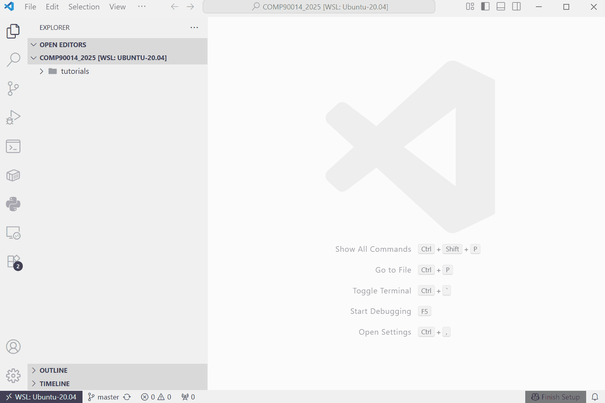

# COMP90014 Tutorial and Assignment Repository

**Purpose**

Follow the instructions here before/during the first tutorial.

This repository holds: 
- Weekly tutorial notebooks
- Weekly tutorial solutions (released the week after each tutorial)
- Assignment material

As this is a github repository, you will need to clone it once, then pull updates each week.   
Instructions on how to do this are below. 

**Python Notebooks**

COMP90014 tutorials are presented as python notebooks. 
These provide an interactive experience and have the .ipynb extension ("<u>I</u>nteractive <u>PY</u>thon <u>N</u>ote<u>B</u>ooks"). In COMP90014, we use Visual Studio Code (VSC) to manage python notebooks.

**Completing Tutorials**

During tutorials you should use VSC which supports .ipynb files. Only use an alternative if you **really know what you're doing**. We will only provide instructions / assistance for VSC. 

**Completing Assignments**

For assignments, you will submit plain .py files. Visual Studio Code is the recommended IDE. You may use any other tools at your own risk.

  

## Operating System Setup (Windows Only)

***Linux or Mac*** must be used as operating system in this subject.  If you already have either of these, skip this section. 

If you have a windows PC, fear not!  
Linux can be run on windows via the *Windows Subsystem for Linux (WSL)* utility.

**Installing Linux via WSL**

*Install WSL*
1. Open PowerShell or Windows Command Prompt in administrator mode by right-clicking and selecting "Run as administrator"
2. Enter the <small>`wsl --install`</small> command
3. Restart your machine
4. Open PowerShell or Windows Command Prompt and enter <small>`wsl -l -v`</small> to check that the Ubuntu VERSION == 2.

*Configure your Linux Distribution*
1. Open 'Ubuntu' using the start menu
    - WSL installs the Ubuntu Linux Distribution by default. 
    - On first open, Ubuntu will install & configure itself.
2. Create a username and password
    - This serves the same purpose as user/password on your windows OS. 
    - Details can be different from windows login. 
3. Update the Ubuntu package manager
    - Ubuntu uses the <small>`apt`</small> package manager. 
    - Package managers allow you to install software on your Ubuntu machine.
    - Think of <small>`apt`</small> as the Linux equivalent of the Microsoft Store.
    - The <small>`apt`</small> package manager needs to be periodically updated so it's aware of currently available software & versions. 
    - Run the <small>`sudo apt update && sudo apt upgrade`</small> command to update <small>`apt`</small>. 

*Having Issues?*
- See the guide at https://learn.microsoft.com/en-us/windows/wsl/troubleshooting
- Talk with one of the teaching team. 

 

## Installing Visual Studio Code (and adding extensions)

**Installing VSC**

We recommend Visual Studio Code (VSC) in this subject as it is lightweight and has rich support for extensions to add functionality.  
Download Visual Studio Code for your system from [here](https://code.visualstudio.com/download) and follow the instructions for:
- [macOS](https://code.visualstudio.com/docs/setup/mac)
- [Linux](https://code.visualstudio.com/docs/setup/linux)
- [Windows](https://code.visualstudio.com/docs/setup/windows)

Once installed:
1. Open VS Code
2. Open a workspace by clicking 'Open Folder' in the 'Explorer' tab (top item of left navbar).
3. Open the week1 folder under tutorials (or other weeks tutorial folder)

**Starting VSC on Windows PCs**

If running Linux via WSL, connect VSC to your Linux distribution each time it is opened. 
1. Click the 'Open a remote window' button (bottom left corner)
2. Select 'Connect to WSL' 

 

**Adding Extensions**

Out of the box, VSC doesn't have much functionality. It's intended to be configured by the user to tailor VSC based on their needs.  

In our case, we will use VSC to:
- Develop python code
- Author and run .ipynb files 

To add this functionality to VSC we will install some *extensions.* 
Extensions add features & support to your VSC. 

Add the following extensions (or confirm they are already installed):
- Python
- Jupyter
- Jupyter Keymap
- Jupyter Notebook Renderers

 

  

## Accessing Tutorial/Assignment Material

**First time**

You will need to 'clone' this repository to access tutorial and assignment content.   
This creates a local version of the repository on your computer.  

> Note:
Git repositories are not different to normal folders - they have files and directories as usual.   
The only difference is that they contain an additional folder (`.git`) which tracks changes and stores information about the state of the repository. 

How-to:
1. Navigate to the 'Source Control' tab
2. Click 'Clone Repository'
3. Select 'Clone from Github'
4. Type & select 'melbournebioinformatics/COMP90014_2025'
5. Specify where you want the folder to be created on your computer.

This folder is now present on your computer.    
To access it again later, just open the folder in VSC (no need to clone the repository again).

 

 

**Weekly Updates**

For each week, we update new tutorial materials through GitHub.

You need to sync your local version of the COMP90014_2025 repository each week to pull these updates. 

As some students have experienced merge conflicts when working directly within the COMP90014_2025 folder on their computer, here are new instructions. 

1. Open the COMP90014_2025 cloned folder using VS Code.
2. Navigate to the 'Source Control' tab.
3. Click the three dots '...' next to the 'CHANGES' heading.
4. Select 'Pull' to sync updates.
5. ***Copy the updated week tutorial / assignment folder to a separate location on your computer [NEW INSTRUCTION]***
6. ***Finally, open VS Code to the new folder [NEW INSTRUCTION]***

By copying the tutorial / assignment folder into a new location (outside the COMP90014_2025 folder), any updates to the official material won't conflict with changes you have made. This is because the copied folder is no longer within your local version of the COMP90014_2025 repository. 

 

