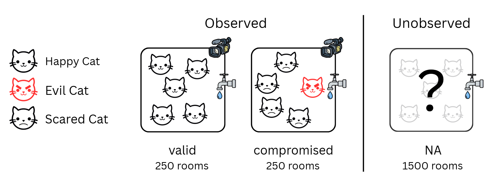

# Assignment 3 - Evil Cats!

**Academic integrity**

This assignment should be completed by each student individually. <br>
Make sure you read this entire document, and ask for help if anything is not clear. <br>
Any changes or clarifications to this document will be announced via the LMS. <br>

Please make sure you review the University's rules on academic honesty and plagiarism: https://academichonesty.unimelb.edu.au/

Do not copy any code from other students. This is considered plagiarism.

Any ***small blocks*** of code (single line, small function) copied from the internet must be appropriately cited, including LLM output such as ChatGPT, Gemini, Claude etc. ***Large blocks*** of code (>10 lines) are not permitted. 

To cite code, include a comment above the section of code which was used. This comment should provide a URL link to the webpage, or the name of the LLM used. 

**Submission**

Your completed `A3.py` file will be turned in via LMS.

We use Turnitin for all assignments, which will compare your code to other students for similarity. It also compares your code against the web and estimates what proportion was generated by an LLM. 

***On the Assignment 3 submission page, you must additionally write a response to the question.***

-----------

**Disclaimer**

No cats were harmed in the making of this assignment. 

This scenario would never get ethics approval, but if we switch cats to mice, it likely would. Here's a relevant paper (if interested) where authors implanted human cancer cells into mice to study metastasis: https://www.nature.com/articles/s41586-020-2969-2 


### Prompt

Your research group was involved in a preclinical trial of a revolutionary new cancer therapeutic drug. The study aimed to test the efficacy, toxicity, and pharmacodynamics of the drug in cats before moving to human testing. 

The experimental design included 10,000 cats (all of which had cancer) organised into 2,000 rooms, each room containing 5 cats. The drug was administered via the water supply to 1,000 rooms, with the other 1,000 rooms acting as a negative control. In this manner 50% of cats received the drug, and the other 50% did not.  To test efficacy, CT scans were taken before and after the trial of each cat's tumor. To assess toxicity and pharmacodynamics, urine samples were taken before and during the trail and analysed via Liquid Chromatography-Mass Spectrometry (LC–MS). 

Initial analysis produced confusing results. This prompted a comprehensive review of the study, including consulting video footage from a subset of the rooms. The video footage revealed that an 'evil' cat was present in approximately half of the rooms, scaring the other cats. The scared cats were so afraid they didn't drink much water, meaning they did not receive a normal dose of the drug!  

Researchers were very concerned about this fact, as it was compromising the whole study.  A crisis meeting was held to discuss what action could be taken. The trial was very expensive so everyone agreed that repeating it was not an option.  However, your team realised there was still a chance to save the experiment - simply remove any room which contained an evil cat from the study. Unfortunately only 500 of the 2,000 rooms were the new 'upgraded' type which contained a camera (observed rooms). The other 1,500 rooms did not contain a camera, so it is unknown whether the room contained an evil cat or not (unobserved rooms). 

<br>

Just when all hope seemed lost, you had a brilliant idea! Thinking back to your time in COMP90014, you realised this situation was a classic machine learning task. You explained to your team that the clinical metadata and existing LC-MS data (initially collected to study toxicity and pharmacodynamics) could be used to build predictive models. You reason that certain cats in the dataset may be more likely to be aggressive than others, and as scared cats drink less water, this would result in metabolic differences. This would be a supervised machine learning task, where each of the 500 observed rooms with video cameras receive a label of 'compromised' or 'valid' depending on whether an evil cat was present, and each cat within these rooms receive a label of 'happy', 'scared' or 'evil' based on their behavior. In this manner, a classification algorithm could be built to predict whether the remaining 1,500 unobserved rooms were compromised. 

With everyone's hopes resting on your shoulders, you began working. 


--------

### Program Specifications for this Assignment 

Write a python program which makes predictions about each unobserved room. 

Use the supplied metadata and log2 abundance values (derived from LC-MS data) to make your predictions. Unobserved rooms have a **NA** value for the 'Room_Status' and 'Cat_Behavior' columns of the metadata file. 

Example use:
```
python A3.py --abundance [path] --meta [path] --outfile [path]
```

***Inputs***

The program should accept as input: 
- Tabular file containing log2 abundance values across 1000 metabolites for each cat (`--abundance`). 
- Clinical metadata for all 10,000 cats and 2,000 rooms in the study (`--meta`). 

Assumptions you can make:
- Within 'valid' rooms, all cats are happy. 
- Within 'compromised' rooms, only one cat is 'evil'. The other cats are all 'scared'.
- Happy cats drink a **normal** amount of water. 
- Evil cats drink a **normal** amount of water. 
- Scared cats drink **almost zero** water.


***Outputs***

The program should produce as output: 
- A single tabular file containing predictions and confidence scores for all unobserved rooms (`--outfile`). 

This file should have the following structure:

| Room_ID | compromised | probability | 
|---|---|---|
| Room 283 | 1 | 0.872 |
| Room 1001 | 0 | 0.003 |
| Room 512 | 0 | 0.109 |
| ... | ... | ... |

Datatypes
- *Room_ID*: string
- *compromised*: integer, where 0=='valid' and 1=='compromised'
- *probability*: float in range (0-1)

Only 1,000 rooms (5,000 cats) are required for the trial to be considered viable. 
250 rooms have already been identified as 'compromised'. As such, only 750 rooms in your output file should be marked as 'compromised' using a **1**. 

--------

### Completing the Assignment

>If you have a windows PC (like me), ensure you have installed WSL and have connected to WSL when using visual studio code. Instructions for how to do this are available in the main README.md file of the [COMP90014 github repository](https://github.com/melbournebioinformatics/COMP90014_2025).

**What is this assignment?**

Assignment 3 gives you hands-on experience working with a typical machine learning task. The main components are as follows:
- Preprocessing 
    - Load the data.
    - Handle missing values in the metadata.
    - Handle metabolites with zero abundance values (some/all cats).
- Data mining
    - Explore the metadata / abundance data.
    - Decide how these will be used to make predictions.
- Feature engineering
    - Either select existing features or create new ones.
- Train / test split 
    - Split the data for training and independent evaluation. 
- Holdout
    - Use an appropriate holdout method during training for validation and hyperparameter tuning.
- Use performance metrics to evaluate your model(s)
    - Make sure your approach isn't overfitting!

**External Packages / LLMs**

Use of external packages such as pandas, seaborn, matplotlib, scikit-learn, scipy etc are heavily encouraged for this assignment. Similar to the tutorials in COMP90014, I recommend using an `.ipynb` notebook during development of your submission. Using a notebook is perfect for machine learning tasks as you can quickly view tables and create visualisations. 

To avoid significant pain, I recommend using an LLM during this assignment. An LLM will help you with pandas syntax and using external package APIs. As a reminder, copying large blocks of code is not allowed, and frankly not advised. Use LLM output as a reference from which you structure your own code. 

**Setup**

1. Clone or pull updates from the [COMP90014 github repository](https://github.com/melbournebioinformatics/COMP90014_2025) to your computer. 
2. Copy the `A3` folder (`COMP90014_2025/assignments/A3`) and paste it somewhere else on your computer.
3. Open Visual Studio Code to your copy local of the `A3` folder.
4. Complete the `A3.py` file then upload to the LMS.

We advise you create a `venv` or `conda` (not recommended) virtual environment for the project.


**Project Structure**

Your workspace should have the following structure before you begin. 
```
├── A3.py
├── README.md
├── data
│   ├── abundance.tsv
│   └── meta.tsv
└── media
    └── evil_cats.png
```

**Your Solution**

To complete the assignment, implement your solution in `A3.py`.

You will need to write helper functions which:
- Read input files.
- Implement small tasks.
- etc, you know the drill. 

These should be called from the `main()` function. 

The logic to accept user input has been implemented for you (argparse). 

**Test Suite**

There is no test data for Assignment 3. 

Instead, employ the concepts taught in the 'training and evaluation' lecture to assess performance of your model(s). 

***Remember to save your work early and often.***

--------

### Marking

Assignment 3 contains a python component and a written component. 

***Written Component (4 marks)***
 
On the LMS page for Assignment 3 you need to upload a .txt or .pdf file alongside your A3.py file. In this file, describe and justify your approach to preprocessing, data mining, training, validation, and performance estimation. You are encouraged to include tables or images but these are not strictly required. 

To create a PDF file, we recommend creating a markdown (.md) file in VSC first, then using the 'Markdown PDF' VSC extension to export it to PDF. This will result in a neatly formatted written component and will allow you to include images / tables.  

***Python Component (11 marks)***

Submit your `A3.py` file via the Assignment 3 LMS page as usual.

The provided data for Assignment 3 was generated synthetically. While you have only been provided labels for the 'observed' rooms, we know the true label for each 'unobserved' room. Your output file will be compared to the true label for each 'unobserved' room to judge correctness. Standard performance measurement tests relevant to the task will be used. 

As this task is quite different from a normal assignment, runtime and space efficiency marks are worth less and are not pro-rata. You will obtain full marks for runtime and space performance as long as your submission runs within 5 minutes and consumes less than 4 Gb memory. 

General marking guide for python component:

- Correctness (80%)
    - Students will be grouped into categories based on predictive performance and marks allocated accordingly. 
- Runtime & space efficiency (10%)
    - Runs within 5 minutes and consumes less than 4 Gb memory.
- Code structure / readability (10%)
    - A3.py has useful comments within each function.
    - Functions are not more than 40 lines long, not including comments (5-10 is a good length).
    - Functions are not heavily nested (due to conditional statements / loops). Maximum 3 levels within a function. 


The reference solution achieves 90% prediction accuracy. 


